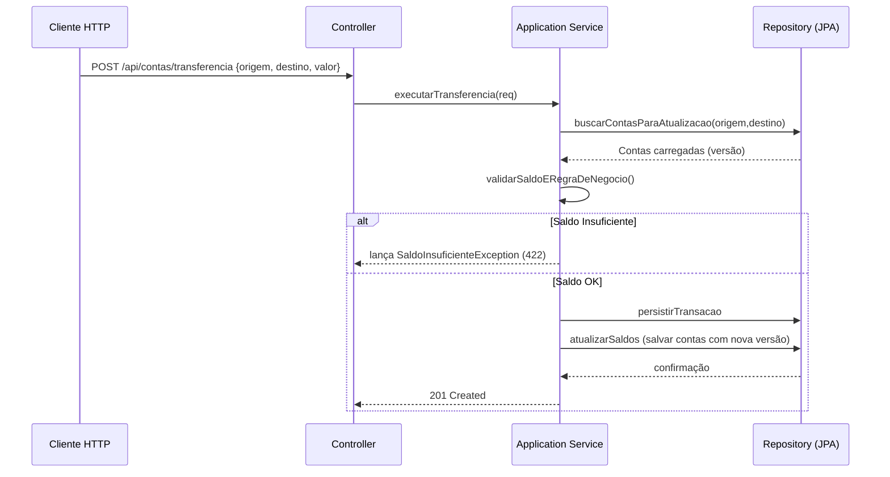

# conta-bancaria-api

Este repositório contém uma API REST para gerenciamento de contas correntes e movimentações financeiras. O projeto foi desenvolvido com foco em **alta integridade de dados**, **rastreabilidade total** e **resiliência**, utilizando padrões de arquitetura modernos para sistemas críticos.

### Arquitetura e Design Patterns

A aplicação foi construída sobre os pilares da **Arquitetura Hexagonal (Ports & Adapters)**, garantindo que as regras de negócio sejam independentes de frameworks, bancos de dados ou protocolos de comunicação.

*   **Domain-Driven Design (DDD):** O coração da aplicação é o Domínio, onde residem os *Value Objects* (CPF/CNPJ, Números de Conta) e as entidades que garantem as invariantes de saldo.
*   **Imutabilidade:** O histórico de transações (Ledger) é estritamente imutável, servindo como fonte primária para auditoria e composição de extratos.

---

### Decisões arquiteturais e justificativas

- **Arquitetura:** Hexagonal (Ports & Adapters). O núcleo de domínio (entidades, regras e casos de uso) está isolado dos adaptadores (controllers, repositories). Isso facilita testes, evolução e troca de implementações externas.
- **Modelagem:** um DDD simplificado é adotado — as regras de negócio centrais (validação de documento, regras de débito/crédito, invariantes de saldo) residem no domínio.
- **Consistência e concorrência:** a aplicação originalmente usou lock pessimista para atualizar saldos, mas foi migrada para versionamento otimista (campo @Version) para melhorar escalabilidade. Em cenários de alta concorrência, conflitos de versão são esperados; a estratégia é tratar esses conflitos como falhas transitórias e aplicar retry no nível do cliente ou testes (não no serviço), preservando invariantes e evitando retry automático que poderia mascarar problemas de carga.
- **Auditoria:** em produção o projeto junta Spring Data auditing (createdAt, updatedAt) e Hibernate Envers para manter um histórico imutável das entidades. Durante os testes locais usamos uma configuração que desabilita o registro automático de listeners do Envers para evitar problemas de DDL em H2 (veja src/test/resources/application-test.properties).


### Stack Tecnológica

*   **Linguagem:** Java 17
*   **Framework:** Spring Boot 4.x
*   **Persistência:** PostgreSQL (Produção) / H2 (Testes)
*   **Containerização:** Docker & Docker Compose


### Como executar (desenvolvimento)
**Pré-requisitos**
*	Docker e Docker Compose
*	Java 17

1) **Subir dependências (PostgreSQL) via Docker Compose**:

```bash
docker compose up -d
```

2) **Executar a aplicação:**

```bash
mvn spring-boot:run
```

3) **Acessar Swagger:** 

```bash
`http://localhost:8080/swagger-ui.html`
```

### Fluxo de Sequência: Transferência entre Contas




### TODO

- [ ] Avaliar sharding de contas para escalar gravações intensivas.
- [ ] Controle de Vazão e Anti-Fraude (Rate Limiting)
    - [ ] Aplicar Rate Limiting por recurso crítico (ex.: endpoint de transações) usando Resilience4j para demo e Bucket4j/Redis para produção distribuída.
    - [ ] Definir políticas por chave: por endereço IP, por documento (CPF/CNPJ) e por conta autenticada.
    - [ ] Implementar idempotency keys para operações mutáveis (transações) e evitar duplicações em retries.
- [ ] CQRS para separar leitura e escrita, otimizando consultas de extrato e histórico sem impactar a performance de gravação.
- [ ] Aplicar HATEOAS nas APIs
- [ ] Implementar validação real de dígito verificador via Módulo 10 ou 11 (padrão bancário brasileiro)
- [ ] Tratar os responses para não enviar dados sensíveis